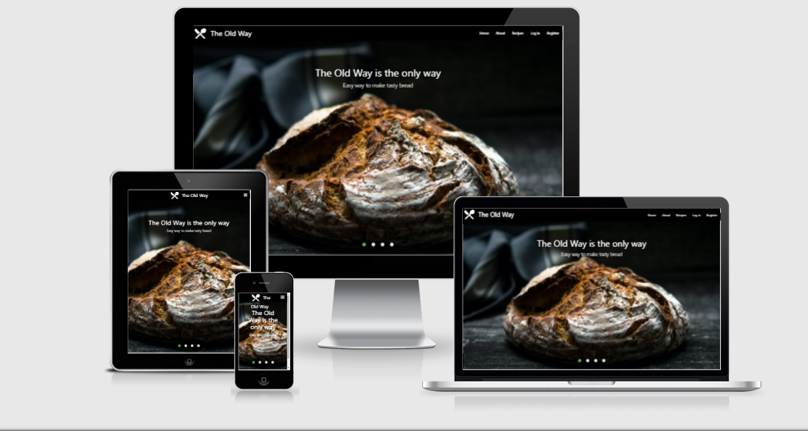
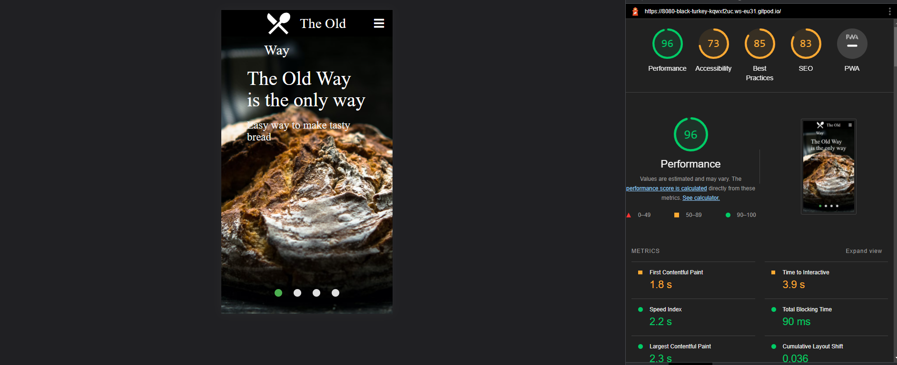

### Welcome to "The Old Way".

Bread is one of the most old meals in the wrold. According to history, the earliest bread was made in or around 8000 BC in the Middle East, specifically Egypt. The quern was the first known grinding tool. ... Romans invented water-milling around 450 BC and as such, they took bread to what was subsequently regarded as an art form.
In this website you will be able to shere and create different bread recipes.
See other poeples post and find delicous bread recipes.

 # --------------------------------------------

 
 # Users Experience

## User stories 

* First Time Visitor Goals
        
- User is able to interact with tools such as search engine and adding recipes.
* As an individual who has interest in Cooking and Bread, I want to see easy meniu selection and understandable layout.
* As an individual who has interest in Cooking and Bread, I want to see visual presentations of recipes.
* As an individual who has interest in Cooking and Bread, I want to see the source of your experience, trusted links like soclia media.

## Returning Visitor Goals

* I want to find relevent infomation regarding recipes.
* I want to find most sutible way to get in touch if I have any questions.
* I want to find links that I can benefit from.
* I want to find new information about baking. 
    

## Frequent User Goals 

* I want to check for updated pcitures with different recipes.
* I want to find new links for relevent subjects.
* I want to find tips on baking equipment.
* I want to check for updated recipe library. 

## Owners site goals

* Deliver users understadning of passion for cooking and baking.
* Connect people whos has same interested in that field.
* Show image owner capabilities.
* Show life benefits from recipes.

## Imagery

* Welcoming slider of homepage was created for user to experience first time impression.
* Imagery was use from:
# --------------------------------------------
* [unsplash](https://unsplash.com/)
* [jamieoliver](https://www.jamieoliver.com/)
* [sallysbakingaddiction](https://sallysbakingaddiction.com/)
* [bbcgoodfood](https://www.bbcgoodfood.com/recipes/easy-white-bread)
 # --------------------------------------------
 

 ## Features
   * Resposive on all devices
   * Interective elements
   * Search 
   * Log in 
   * log out 
   * Register
   * Add recipes
   * Edit Recipes
   * Delete Recipes
   * View recipes 

   

# --------------------------------------------  

 ## Languages

  * [HTML5](https://en.wikipedia.org/wiki/HTML5)
  * [CSS](https://en.wikipedia.org/wiki/CSS)
  * [Python](https://en.wikipedia.org/wiki/Python_(programming_language))
  * [Javascript](https://en.wikipedia.org/wiki/JavaScript))
  

 
# --------------------------------------------

## Frameworks, Libraries & Programs Used

1. [materializecss](https://materializecss.com/)
   * Materializecss was used to make better responsiveness and styling of the website.

2. [Google Fonts](https://fonts.google.com/)
    * Google Fonts was used to import Special Elite, cursive font in the style.css file witch is used to all pages.

3. [Git](https://git-scm.com/)
    * Git was used for version control by utilizing the Gitpod terminal to commit to Git and Push to GitHub.

4. [GitHub](https://github.com/)
    * GitHub is used to store the projects code after being pushed from Git.

5. [Flask](https://en.wikipedia.org/wiki/Flask_(web_framework))
    * Flask was used to make easy interaction with python

6. [Balsamiq](https://balsamiq.com/)
    * Balsamiq was used to creat wireframes during design process.

7. [Jinja](https://en.wikipedia.org/wiki/Jinja_(template_engine))
    * Jinja was used for web template for the Python programming language

# Testing 

## Lighthouse results:

The W3C Markup Validator and W3C CSS Validator Services were used to validate every page of the project to ensure there were no syntax errors in the project.

* [W3C Markup Validator](https://validator.w3.org/#validate_by_input+with_options)

* [W3C CSS Validator](https://jigsaw.w3.org/css-validator/#validate_by_input)

## Testing User stories

* First Time Visitor Goals

    i. As a First Time Visitor, I want to easily understand the main purpose of the site and learn more about Bread.

        a. Upon entering the site, users are automatically greeted with a clean and easily readable navigation bar to go to the page of their choice.
        b. The main point are made. with the slider images homepage.
        c. The users are presented with ptions to easy navigate throught page.

    ii. As a First Time Visitor, I want to be able to easily be able to navigate throughout the site to find content.

        a. The site has been designed for a clear understanding for users, all options located in the same space with clear font and clear colors.
        b. Footer will provide with inspired links to get you in to baking. 
        c. Abotu page was created to get inspired hisotry of bread.

### Returning Visitor Goals:

        a. As a returining user i want to find updated pictures and recipes, maybe an option for a recipe calculator in the Future. 
        b. As a returining user i want to find links for equipment and more info on baking.
        c. As a returining user i want to find tip and trick to cooking.

### Frequent User Goals: 

        a. Frequent users will be able to find new information on baking equipment.
        b. Frequent users will have the opportunity to view updated recipes.
        c. Frequent users will be given more tips on baking bread.

### Further Testing:

a. Mobile version testing (Iphone7/8/9/10.., Ipad pro, I pad )
b. Browsers test ( firefox, internet explorer, google chrome, brave, opra.)
c. Testing web site was commited by friends and family members, to check sites responsiveness and layout.
d. Night mode on mac and windows. 

# Credits 

* [Stackoverflow](https://stackoverflow.com/) - thank you to this amazing community for possibility to get good info.
* [juanstelling](https://github.com/juanstelling/MS3_breaktasty) - thank you Juan for amazing website it was my plesure to take insparation from a such buetiful mind.

* [W3schools](https://www.w3schools.com/) - one of the best library of explanation and tutorials.
* [Bootstrap](https://getbootstrap.com/) - Using this amazing library of codes it was a big help.
* [Codeinstitute](https://codeinstitute.net/) - big thanks to code institute for creating this 
amazing program to learn coding !!!!!!